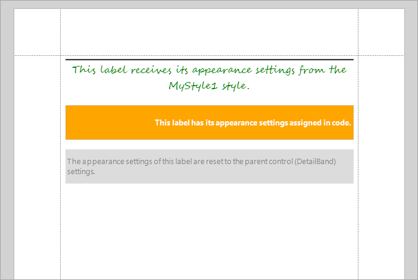

<!-- default badges list -->

<!-- default badges end -->
# Reporting for WinForms - Appearance Settings, Styles, Style Priority

This example shows a report with the following labels:

- a label with appearance setting applied using a custom style
- a label with appearance settings assigned directly in code
- a label with appearance settings reset, so that the label takes appearance settings of the parent element 

## Files to Review

* [XtraReport1.cs](CS/XtraReport1.cs) (VB: [XtraReport1.vb](VB/XtraReport1.vb))

## Documentation

- [Customize Appearance](https://docs.devexpress.com/XtraReports/2614/detailed-guide-to-devexpress-reporting/customize-appearance)

## More Examples

- [How to create and store report style sheets](https://github.com/DevExpress-Examples/Reporting_how-to-create-and-store-report-style-sheets-e486)
<!-- feedback -->
## Does this example address your development requirements/objectives?

 

(you will be redirected to DevExpress.com to submit your response)
<!-- feedback end -->
